# Seoul Meari 관리자 콘솔

서울 메아리(Seoul Meari) 플랫폼의 관리자 웹 콘솔입니다. AI 도시 진단 결과를 확인하고 해결 처리하며, 사용자가 남긴 AR 메아리와 타임 트래블용 VR 에셋 번들을 관리합니다.

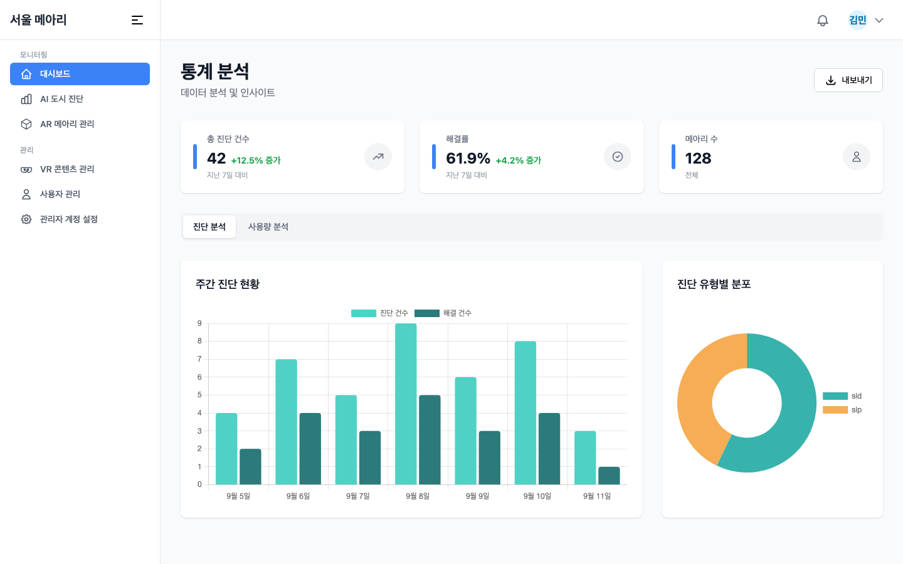

| 구분 | 내용 |
|---|---|
| 프레임워크 | React 18 + TypeScript 5 + Vite 5 |
| 스타일 | Tailwind CSS 3 (일부 styled-components) |
| 상태·데이터 | React Query 3 (서버 상태), Zustand (UI 상태), axios |
| 라우팅 | React Router 6 |
| 차트·내보내기 | Chart.js 4 (react-chartjs-2), html2canvas + jsPDF |
| 품질 | ESLint, Husky pre-commit(`tsc && vite build`) |

## 서울 메아리 프로젝트

| 저장소 | 역할 |
|---|---|
| [Seoul_Meari_Client](https://github.com/Team-Little-Brother/Seoul_Meari_Client) | Unity 모바일 AR 앱 |
| [Seoul_Meari_Backend](https://github.com/Team-Little-Brother/Seoul_Meari_Backend) | NestJS REST API (이 콘솔이 호출하는 서버) |
| [Seoul_Meari_AI_Analysis](https://github.com/Team-Little-Brother/Seoul_Meari_AI_Analysis) | FastAPI 배치 분석 서버 (진단 민원 생성) |
| **Seoul_Meari_manage_Client** (현재) | React 관리자 콘솔 |

## 화면

### 대시보드 (`/dashboard`)

핵심 지표(총 진단 건수, 해결률, 메아리 수)와 주간 진단 현황·진단 유형별 분포, 시간대별 민원 분포를 보여줍니다. "내보내기" 버튼은 화면을 캡처해 PDF로 저장합니다.

| 진단 분석 | 사용량 분석 |
|---|---|
|  | 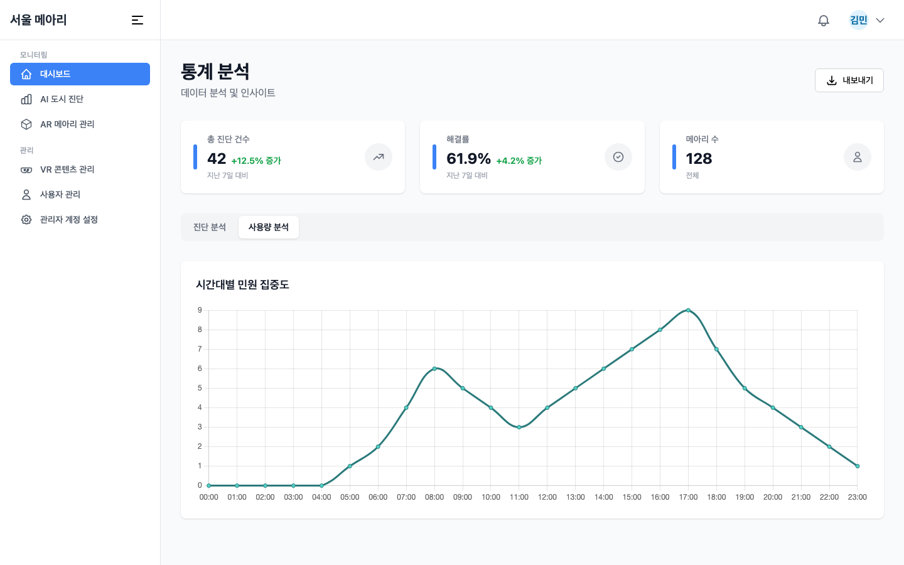 |

### AI 도시 진단 (`/ai-diagnosis`, `/ai-diagnosis/:id`)

AI 분석 서버가 생성한 민원을 상태(전체/해결/미해결)와 정렬(최신순/오래된순)로 필터링합니다. 목록 카드에서 바로 "해결완료" 처리할 수 있고, 지도 보기는 서울시 구 경계 이미지 위에 좌표를 투영해 표시합니다. 상세 화면은 AI 분석 결과(감지 객체, 위험 요소, 권장 조치)와 S3 첨부 이미지를 보여줍니다.

| 목록 | 지도 |
|---|---|
| 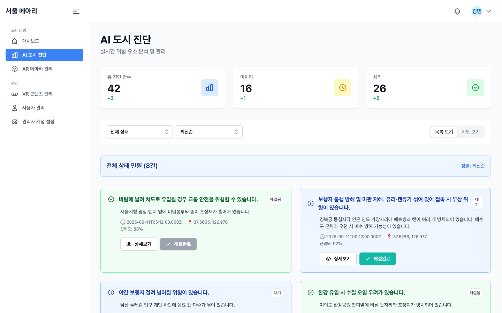 | 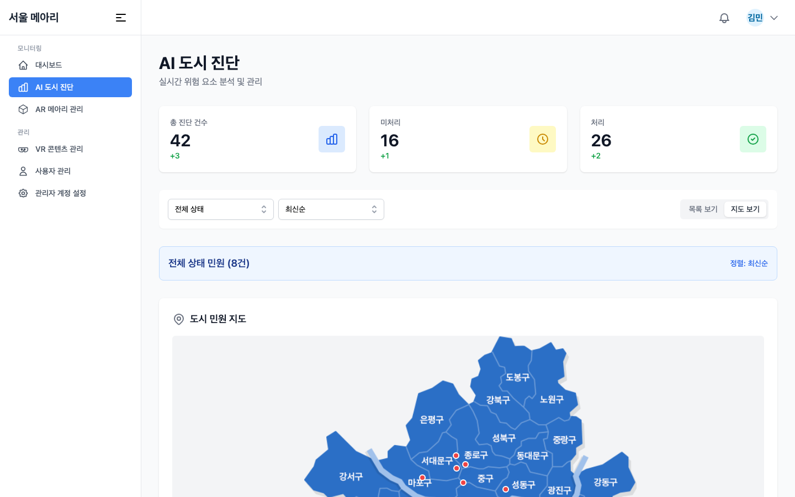 |

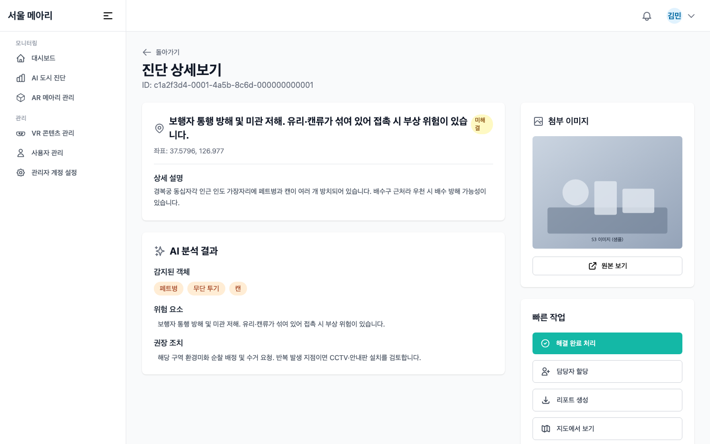

### AR 메아리 관리 (`/ar-echo`, `/ar-echo/:id`)

사용자가 앱에서 남긴 메아리를 내용·작성자로 검색하고 페이지네이션으로 탐색합니다. 지도 보기에서 위치를 확인하고, 상세 화면에서 이미지를 보고 삭제할 수 있습니다.

| 목록 | 지도 |
|---|---|
| 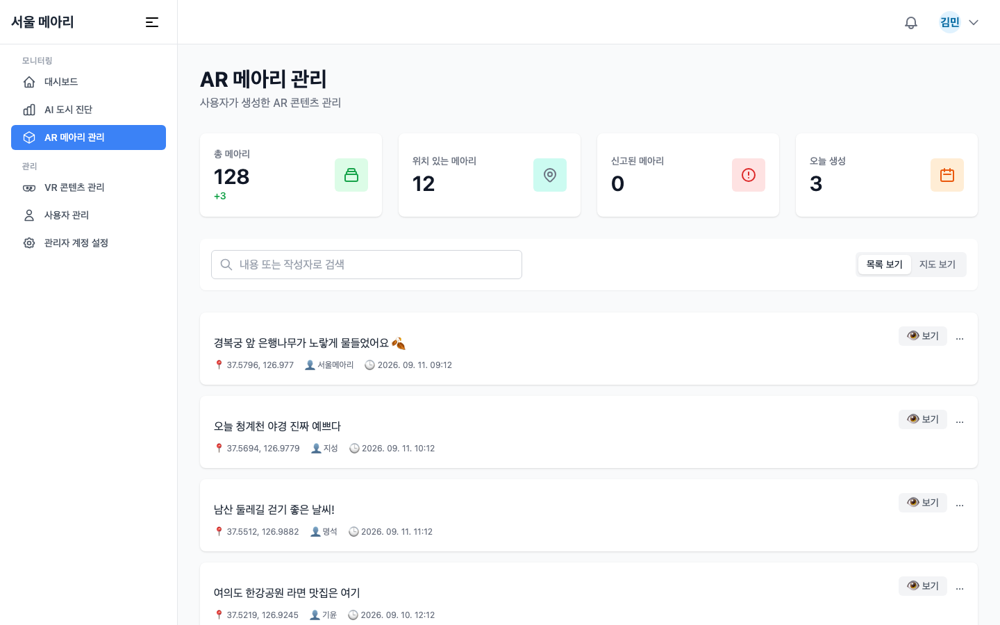 | 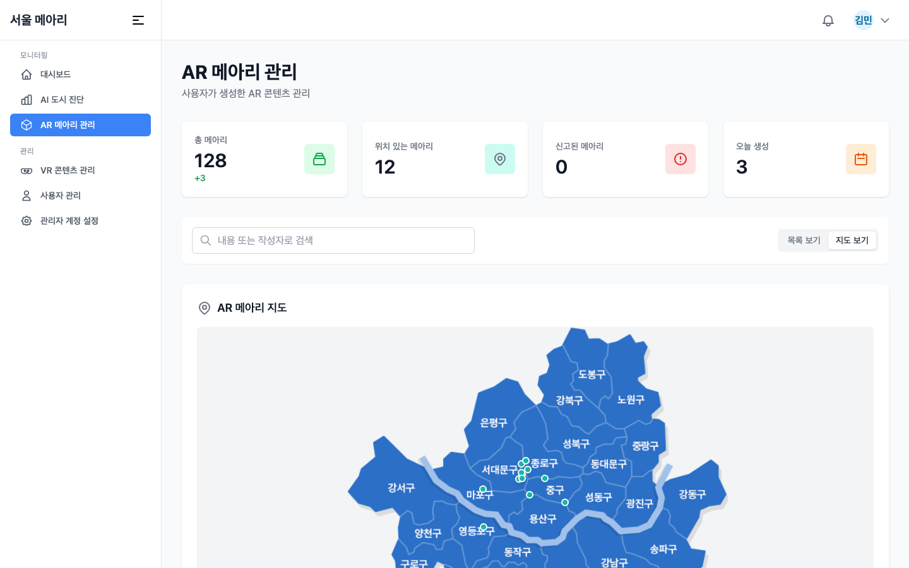 |

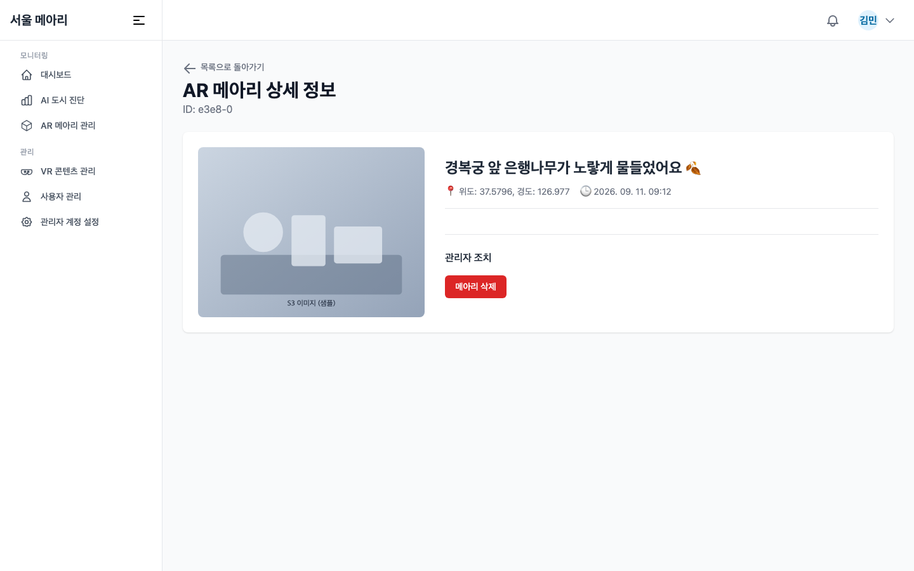

### VR 콘텐츠 관리 (`/vr-contents`)

타임 트래블 씬에서 쓰는 Unity 에셋 번들을 용도(역사/프로모션/둘 다)·상태(드래프트/배포됨/보관됨)·검색어로 필터링하고 정렬합니다. "번들 업로드"는 Presigned URL로 S3에 직접 업로드한 뒤 레이아웃 JSON과 메타데이터(이름, 버전, 위·경도·고도, OS, 태그)를 서버에 등록합니다.

| 목록 | 업로드 모달 |
|---|---|
| 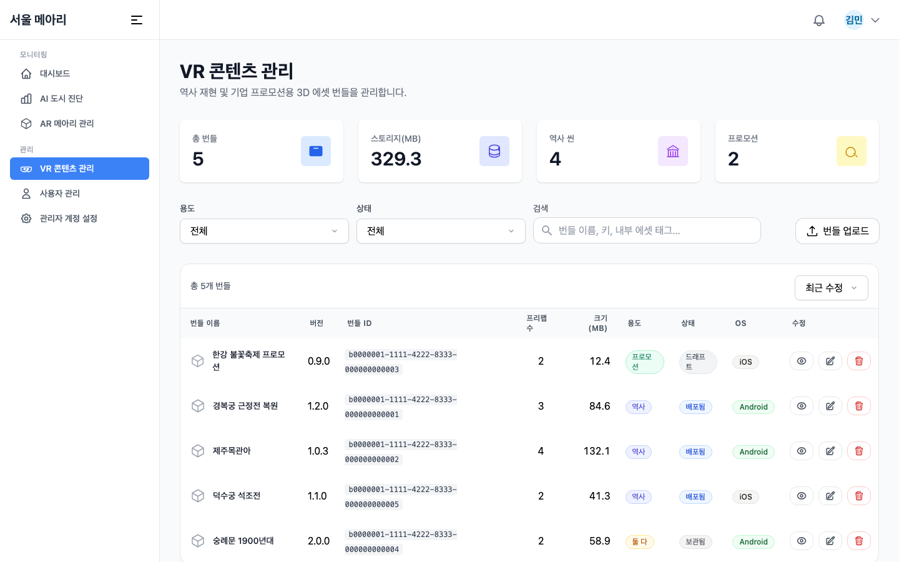 | 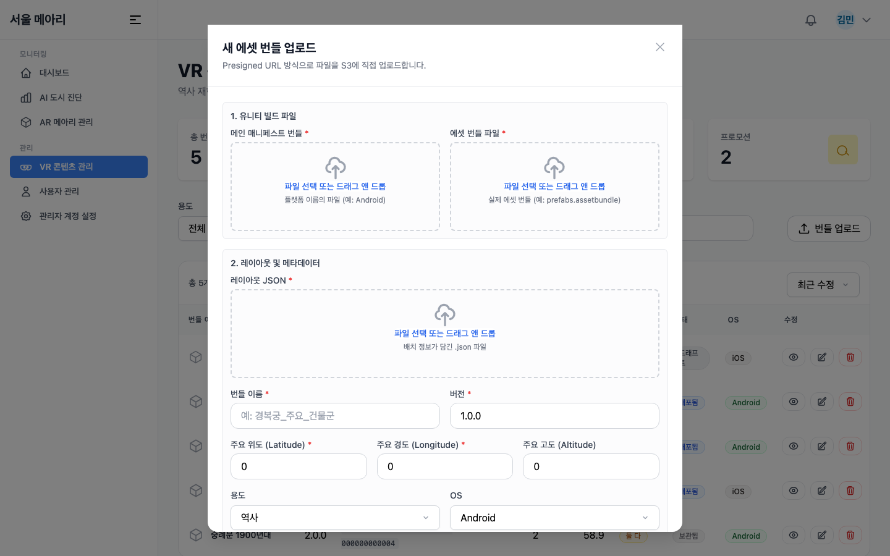 |

번들 업로드 흐름:

1. `POST /api/s3/presigned-urls/bundle` — 메인 매니페스트 번들과 에셋 번들 파일의 Presigned URL 요청
2. 두 파일을 S3에 병렬 `PUT` (Presign 시 지정한 `Content-Type`과 동일해야 함)
3. `POST /api/bundles/finalize-upload` — `FormData`로 `uploadId`, `layoutFile`, 메타데이터 전송

레이아웃 JSON 예시는 업로드 모달의 "예시 보기" 또는 [`src/features/vr-contents/examples/layoutExample.ts`](src/features/vr-contents/examples/layoutExample.ts)에서 볼 수 있습니다.

### 사용자 관리 · 관리자 계정 설정 (`/users`, `/users/:id`, `/admin`)

| 사용자 관리 | 관리자 계정 설정 |
|---|---|
| 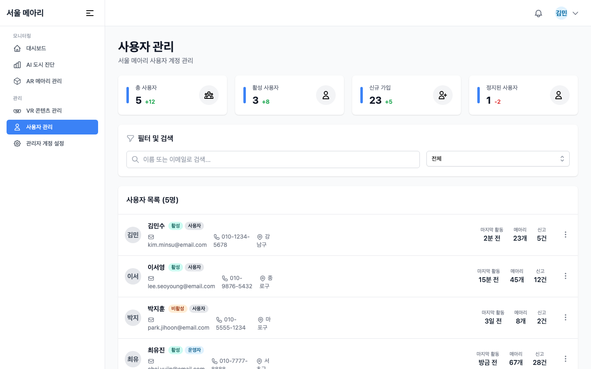 | 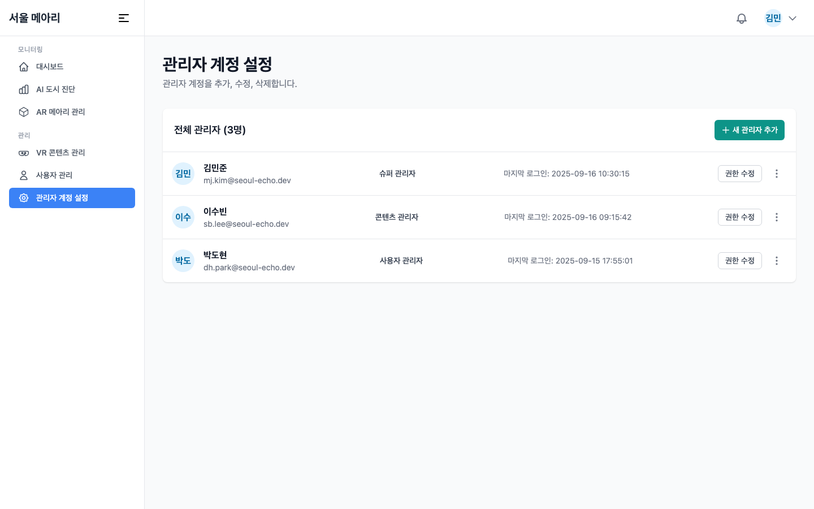 |

이 세 화면과 로그인 페이지는 UI만 구현된 상태이며 목 데이터를 사용합니다(백엔드 `auth`, `admin` 모듈 미구현).

## 백엔드 API 연동

axios 인스턴스의 `baseURL`은 `/api`(같은 오리진)입니다. 배포 환경에서는 `/api` 경로가 NestJS 백엔드로 라우팅되어야 합니다.

| 화면 | 호출 API |
|---|---|
| 대시보드 | `GET /api/dashboard/summary`, `weekly-diagnoses`, `tag-distribution`, `hourly-complaint-distribution` |
| AI 도시 진단 | `GET /api/dashboard/ai-summary`, `GET /api/complaints/complaints-list[/:id]`, `PATCH .../:id/resolve`, `POST /api/s3/presigned-url/manage` |
| AR 메아리 | `GET /api/echo/echo-list?page&limit&search`, `GET/DELETE /api/echo/echo-list/:id`, `POST /api/s3/presigned-url/manage` |
| VR 콘텐츠 | `GET /api/bundles`, `POST /api/s3/presigned-urls/bundle`, `POST /api/bundles/finalize-upload` |

## 실행 방법

```bash
npm install
npm run dev        # http://localhost:5173
npm run build      # tsc && vite build → dist/
npm run preview
npm run lint
```

로컬에서 백엔드(`http://localhost:3000`)와 함께 개발할 때는 `vite.config.ts`에 프록시를 추가하면 `/api` 요청이 백엔드로 전달됩니다.

```ts
// vite.config.ts
server: {
  host: '0.0.0.0',
  port: 5173,
  proxy: {
    '/api': { target: 'http://localhost:3000', changeOrigin: true },
  },
},
```

### Docker

```bash
docker compose up --build   # Vite 개발 서버를 5173 포트로 실행
```

### Husky

`npm install` 시 `prepare` 스크립트가 Husky를 설정합니다. 커밋 전에 `npm run prepush:check`(빌드)가 실행되므로 타입 오류가 있으면 커밋이 막힙니다.

## 프로젝트 구조

```
src/
├── App.tsx                 # 라우트 정의 (MainLayout 하위 페이지)
├── main.tsx                # QueryClientProvider, Tailwind CSS
├── api/                    # axios 인스턴스 + 도메인별 API 함수
│   ├── index.ts            # baseURL '/api', 요청·응답 인터셉터
│   ├── dashboardAPI.ts  complaintsAPI.ts  echoAPI.ts  s3API.ts  vrContentAPI.ts
├── pages/                  # 라우트 단위 페이지 컴포넌트
├── features/               # 도메인별 컴포넌트·훅·타입
│   ├── dashboard/          # StatCard, Charts(Bar/Doughnut), HourlyActivityChart, useDashboardData
│   ├── ai-diagnosis/       # AiStatCard, DiagnosisCard, FilterPanel, ArEchoMap(서울 지도 투영)
│   ├── diagnosis-detail/   # DiagnosisInfo, AiAnalysisResult, AttachedImage, QuickActions
│   ├── ar-echo/            # ArEchoCard, ArEchoFilterPanel
│   ├── vr-contents/        # AssetTable, UploadBundleModal, useBundleUploadForm, types(LayoutJson)
│   ├── user-management/  admin/  layout/
├── components/
│   ├── layout/             # Sidebar, Header, MainLayout, AuthLayout
│   └── common/             # Button, Modal, Table, Select, Pagination, FileDropZone, Spinner …
├── store/uiStore.ts        # 사이드바 열림 상태 (Zustand)
├── assets/map_0.png        # 지도 투영용 서울시 구 경계 이미지
└── lib/, utils/, styles/
```

지도 표시는 외부 지도 SDK 없이 서울시 경계(북 37.701 / 남 37.413 / 서 126.734 / 동 127.269)를 기준으로 위·경도를 이미지 픽셀 위치로 선형 변환합니다.

## 참고 사항

- `docs/screenshots/`의 이미지는 목 API로 렌더링한 화면입니다. 실제 데이터와 수치는 다를 수 있습니다.
- `.env.develop`, `.env.production`의 `VITE_API_BASE_URL`은 현재 코드에서 참조하지 않습니다. `baseURL`을 바꾸려면 [`src/api/index.ts`](src/api/index.ts)를 수정하세요.
- 인증 헤더 주입과 401 리다이렉트는 axios 인터셉터에 주석으로만 준비되어 있습니다.
